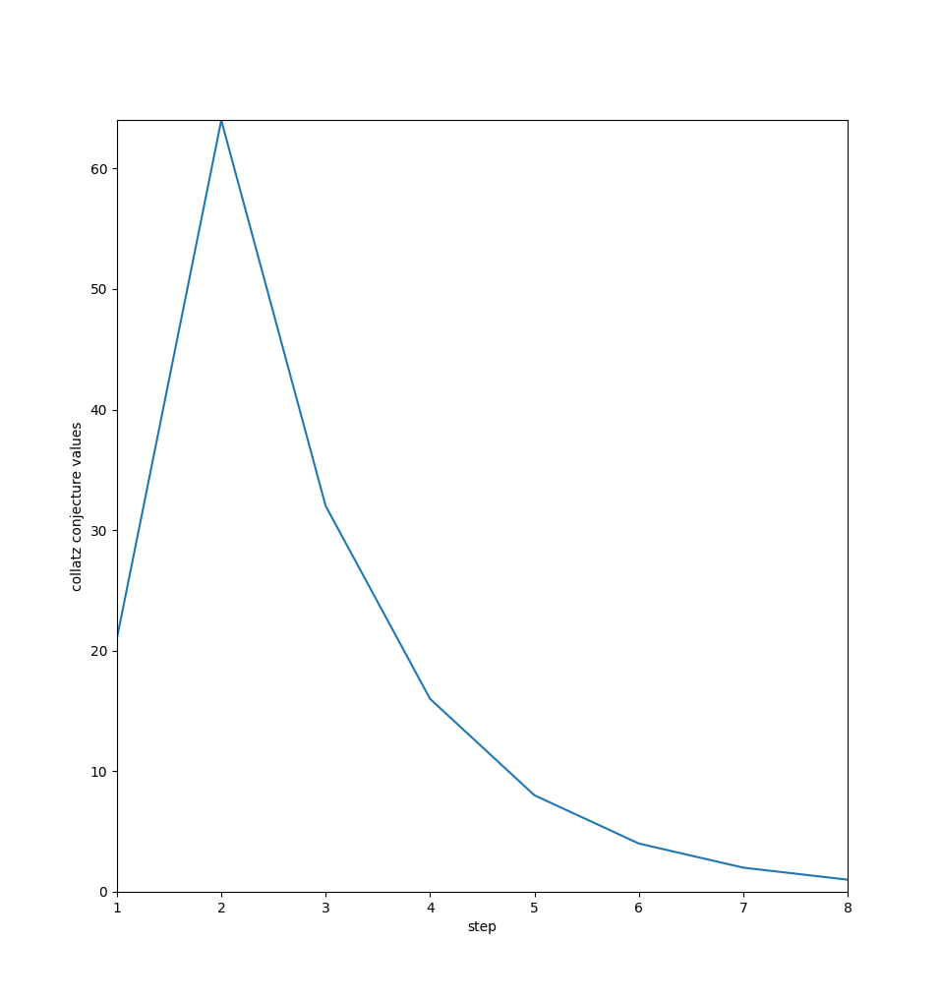

# collatz-conjecture-matplotlib
very simple approach to capture the collatz conjecture visually with simple plotting from matplotlib
# usage
Install matplotlib if not installed already(preferably with virtualenviroment)
```
pip install matplotlib
```
Run the script
```
(venv) ➜  collatz-conjecture-matplotlib git:(main) python3 main.py 
Enter a positive integer to display a plot with collatz conjecture values for the positive integer: 21
```
The plot

